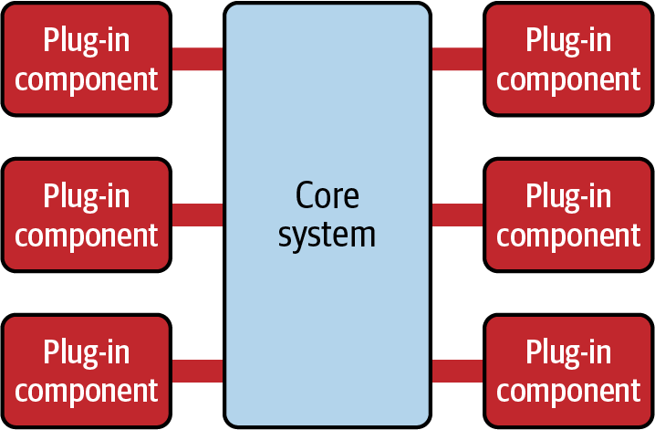
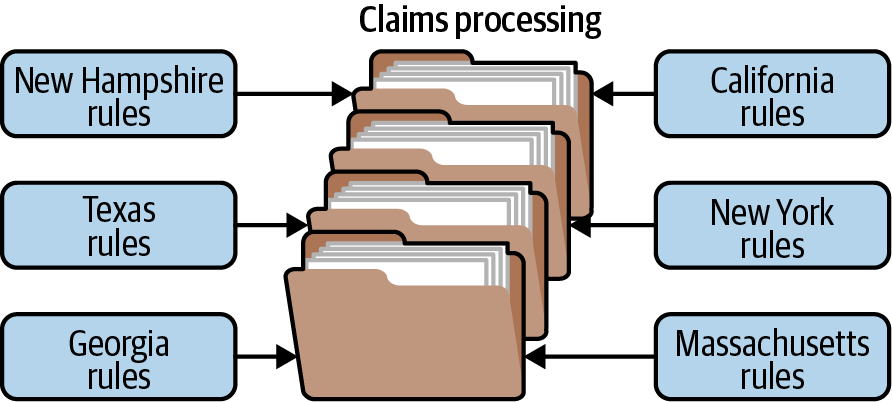

# microkernel architecture

## definition

* it also refers as "plug-in architecture"
* users can add features or additionality in terms of plugins

## topology

* it consists of two types of architectural components
    - core systems
    - plug-in modules

* application code is split between core systems and plug-in modules, which gives
    - extensibility
    - flexibility
    - and isolations

* the core system can have
    - minimum functionality required to function - examples IDEs. The rest of the features can be given as plug-ins
    - some cases, it can also be a full features - examples chrome browsers. The extensions can be provided as plug-ins
 
* plug-in modules
    - they are stand alone, provide enhanced additional features to enhance core system capabilities
    - they are developed as separate modules and connected to the core system by
        + jars or dlls
    - they are managed through frameworks such as OSGI (Open Service Gateway Initiative), Java Modularity, Jigsaw, Penrose and Prism
    - monolithic architecture - these plugins can be deployed as runtime components which can be loaded without-restarting or restarting the core systems.
    - distributed architecture - these plugins can also be deployed as REST endpoint or messaging systems which can be integrated with the core services.

* plug-in registry
    - the core system needs to know what are the plugins are available.
    - the plugins are added to the plugin registry. It have the information about the plugins
        + name
        + contract details and protocol details on how plugins are connected to the core system

## consideration

### analysis
* It is very flexible and granular
* It can effectively support in evolutionary design and incremental development.
* It can be easily embedded to another architecture of the system
    - the plugins can be developed in another architecture style, but can be connected to core system thorough a contract

### when to use
* where application that will have planned extensions
* it is a good choice for products where you will be releasing additional features over time
* you want control over which users get which features
* good choice for applications or products that have multiple configurations based on a particular client environment or deployment model

### when not to use
* All requests must go through the core system, regardless of whether the plug-ins are remote or point-to-point invocations. Because of this, the core system acts as the main bottleneck to this architecture, and is not well suited for highly scalable and elastic systems.
* overall fault tolerance is not good in this architecture style, again due to the need for the core system as an entry point
* if you find that most of your changes are within the core system and you are not leveraging the power of plug-ins to contain additional functionality, this is likely not a good architecture match for the problem you are trying to solve

## examples

- many operating systems are developed based on this architecture
- product or package based applications are developed in this architecture
- eclipse IDE
    * the core system have the basic Eclipse editor
    * However, once you start adding plug-ins, it becomes a highly customizable and useful product for clients
- chrome browser
    * the core system have the basic browser
    * the other plugins adds capability to the browser
- in the below example, the claims rules for different jurisdiction added as plugin. the core system have only the basic rules
  

